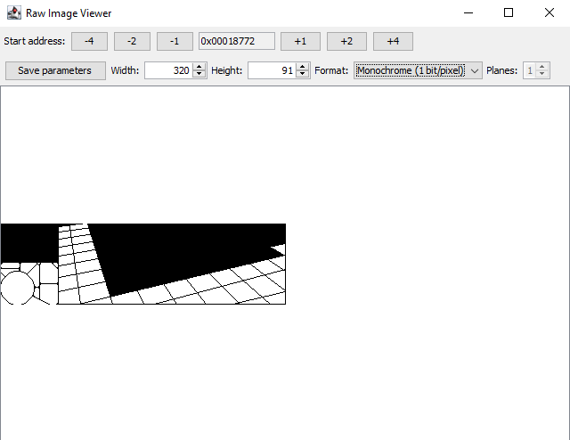

This is a script for Ghidra that allows to view images embedded in a binary file directly from Ghidra.

As usual, this software comes without any warranty or guarantees. It is experimental and incomplete. Use it at your own risk.

# How to install it

That's very easy and just takes a few seconds. It's a script, which means you just have to
1. open the Code Browser window with one of your projects in Ghidra,
1. open the Script Manager window (with the green "Play" button in the toolbar or in the "Window" menu),
1. click on the "Create new script" button in the toolbar of the Script Manager window,
1. add the content of the RawImageViewer.java file as a new Java file.

The script appears in the script category "Visualization" (and in the "Tool" menu of the Code Browser if you have ticked the  checkbox in the Script Manager).

# How to use it

In the Code Browser, go to the address where the image data is located. Run the script. A window opens that shows the data at the current address as an image.

GUI elements:
- The "Save parameters" button saves the current parameters in the precomment at the current address. When you later run the script again at the same address, it can read the parameters from the precomment, provided you have not modified the line containing the parameters or added anything *after* that line in the comment (adding text before that line is fine, though).
- With the "-1 row", "-4", "-2",... buttons you can move the start address of the image by one row, by 4 bytes, by 2 bytes, etc. in both directions. 
- In the "Width" and "Height" input fields, you can specify the size of the image in pixels.
- Different image formats are supported. Note that for the "Monochrome" and "Bitplanes" mode, the number of bytes read per row equals Roundup(Width/8) plus any modulo (see below).
- The input field for the number of planes is only enabled when the "Bitplanes" format is selected. In this format, the bitplanes providing the bits of the pixel values are stored consecutively in memory.
- The "Modulo" field specifies how many bytes are skipped after each row.

A right click on the image opens a menu with one possible action: setting the start address of the image to the address corresponding to the clicked row.

# Missing features (soon...)

- A way to set a color palette for the "Grayscale" format and the "Bitplanes" format. In the current version everything is gray for those two formats.

- Support for the "interleaved bitplanes" format, as popular on the Amiga.

- Support for 16-bit formats

- A zoom function. 320x200 images from old games are very small on modern screens.

- An export function to save the image as a png or bmp file.

