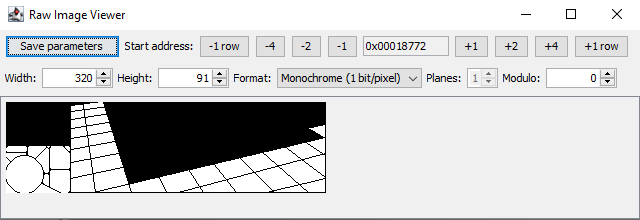

This is a script for Ghidra that allows to view images embedded in a binary file.

As usual, this software comes without any warranty or guarantees. It is experimental and incomplete. Use it at your own risk.

# How to install it

That's very easy and just takes a few seconds. It's a script, which means you just have to
1. open the Code Browser window with one of your projects in Ghidra,
1. open the Script Manager window (with the green "Play" button in the toolbar or in the "Window" menu),
1. click on the "Create new script" button in the toolbar of the Script Manager window,
1. add the content of the RawImageViewer.java file as a new Java script.

The script appears in the script category "Visualization" (and in the "Tool" menu of the Code Browser if you have ticked the  checkbox in the Script Manager).

# How to use it

In the Code Browser, go to the address where the image data is located. Run the script. A window opens that shows the data at the current address as an image.

With the "-4", "-2",... buttons you can move the start address of the image. With the other buttons and input fields, you can set the parameters of the image. Note that the number of planes can only be changed when the "Bitplanes" format is selected.

The "Save parameters" button saves the current parameters as a precomment at the current address. When you later run the script again at the same address, it can read the parameters from the comment, provided you have not modified the comment line containing the parameters or added anything *after* that line.

# Missing features (soon...)

- A "modulo" field where you can specify how many bytes should be skipped after each row of the image.

- A way to set a palette for the "Grayscale" format and the "Bitplanes" format. In the current version everything is gray for those two formats.

- An "interleaved bitplanes" format, as popular on the Amiga.

- A 16-bit format

- A zoom function because 320x200 images from old games are very small on modern screens.

- An export function to save the image as a png file.

